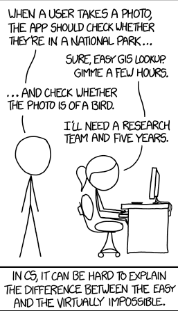

# Introduction to deep learning

I´ve recently started the fast ai course which you can find in this link [fast ai course](https://course.fast.ai) and will try to explain in my own words what I gotten so far from it.
First of all I must say I am pretty mind blown from how far deep learning have gotten the last few years. Jeremy Howard explains in it a fascinating way in the first lesson through a joke.
Quickly summarized the joke is basically that a scientist needs about five years of research to check if a photo is of a bird. In other words explaining that it is practically impossible. 
However, today Jeremy does excatly that in about the first two minutes of his first lesson. That is pretty remarkable. 

He does this through libraries such as fastbook and duckduckgo. These are libraries that allows you to scrape the web for images of interest. Furthermore high level deep learning algorithms that is built on top of pytorch can be used through the fastai library in order to classify the images scraped from the web. Pretty insane! 

This was all I wanted to say today, stay tuned for further updates as I delve deeper into the academic material!
